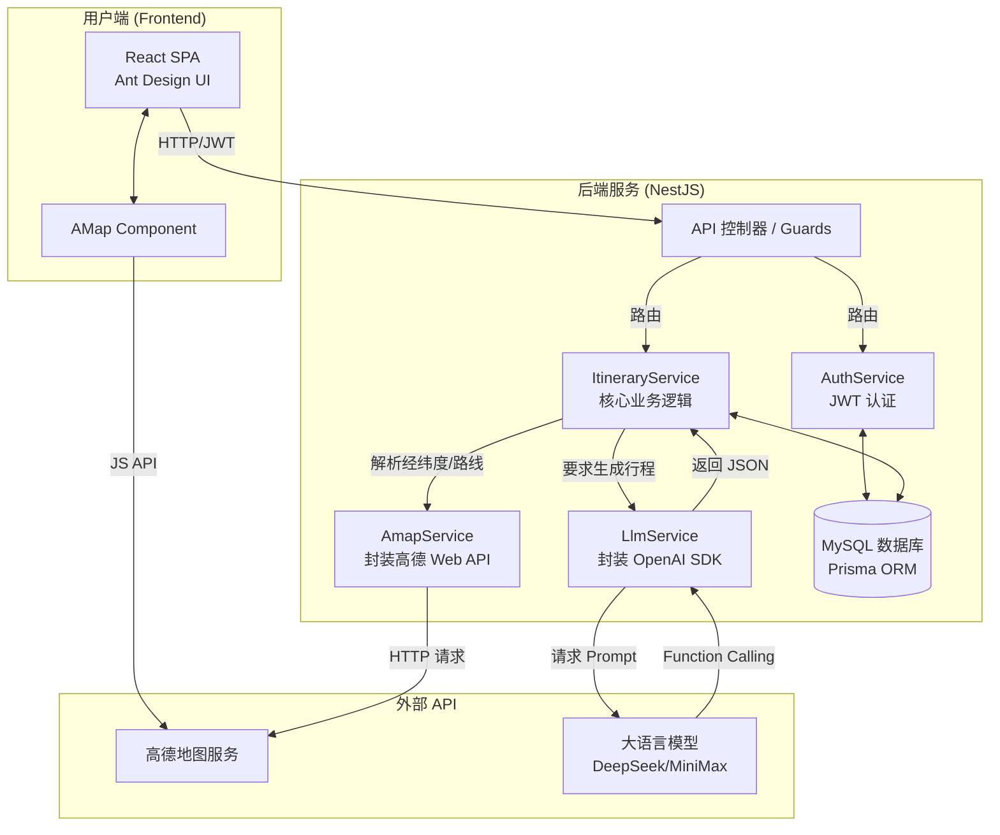

# 旅游路线规划网站 - 项目架构设计文档

## 1. 项目概述

本项目旨在开发一个智能旅游路线规划网站。用户可以根据个人需求，借助大语言模型（LLM）的智能规划能力，一键生成精确到时间点、地点、预算和交通方式的定制化旅游行程。系统支持路线在地图上的可视化展示，提供景点避坑指南，并允许用户随时重新规划。项目遵循企业级开发标准，保证代码质量、可扩展性和可维护性。

### 核心功能：
- **用户系统**：支持用户注册、登录、个人信息管理。
- **AI 智能生成**：根据用户填写的表单（目的地、预算、天数、偏好），调用 DeepSeek/MiniMax 等大模型自动生成每日详细行程，包含花费预估和景点介绍。
- **动态重规**：支持在原有参数基础上“就地更新”重新生成行程，避免数据库 ID 膨胀。
- **时间与路线规划**：为每个目的地安排合理的到达时间、停留时间及游览顺序。
- **地图深度交互**：在高德地图上实时绘制行程路线与坐标。支持点击时间轴卡片与地图视角的平滑联动（高亮、缩放居中）。
- **POI自动检索**：后端将 LLM 规划的景点名称自动通过高德 API 在全国范围内转换为精准经纬度，防止定位漂移。
- **社交数据抓取**：LLM 规划期间可通过 Function Calling 模拟抓取小红书/抖音的最新旅游攻略。

---

## 2. 技术选型

- **前端**：`React` (v18+)
    - **UI 框架**：`Ant Design v5`，使用 `App.useApp()` 统一上下文管理。
    - **地图引擎**：`高德地图 JavaScript API 2.0` (使用 `@amap/amap-jsapi-loader` 动态加载)。
    - **时间处理**：`date-fns`。
- **后端**：
    - **主框架**：`Node.js` + `NestJS` (使用 `TypeScript`)。提供模块化、依赖注入等企业级特性。
    - **数据库**：`MySQL`。
    - **ORM**：`Prisma`。提供强类型安全的数据库访问与 Schema 迁移。
    - **大模型 SDK**：`openai` 官方包（通过配置 `baseURL` 兼容国内模型接口）。
- **部署与配置**：
    - `.env` 环境隔离（数据库链接、JWT、大模型密钥、高德地图密钥）。

---

## 3. 系统架构设计

我们将采用前后端分离架构，核心逻辑围绕大模型数据清洗与地图服务集成。

### 3.1. 架构图

### 3.2. 后端核心模块

- **`AppModule` (根模块)**
- **`AuthModule` (认证模块)**：处理用户注册、登录（JWT 认证）、密码哈希（Bcrypt）。
- **`PrismaModule`**：全局提供数据库实例。
- **`ItineraryModule` (行程模块)**：负责接收前端生成请求，统筹调用 LLM 生成 JSON，再调用高德 API 补齐经纬度，最后使用 Prisma 事务保存至数据库。
- **`MapModule/AmapService`**：高德地图API代理层。处理 POI 搜索（解决受限城市搜不到大景区的问题）、驾车路径距离与耗时估算。
- **`LlmModule/LlmService`**：大模型代理层。
  - 处理国产大模型（如 MiniMax）在 Function Calling 时把 XML 标签写进 `content` 的幻觉。
  - 使用正则表达式强制清除 `<think>`、`<invoke>` 等过程标签，提取纯净 JSON。
  - 修复模型偶尔多写 `":` 导致 `JSON.parse` 失败的格式错误。

### 3.3. 数据库设计 (Prisma)

- `User`: 管理账户与密码。
- `Itinerary`: 行程主表，存储 `title`、`budget`、`estimatedCost` 及前端传来的完整 `generationParams`（用于一键重新规划）。
- `PlanItem`: 每日计划明细表，存储地点名称、具体的 `latitude`/`longitude`、起止时间、`durationMinutes` 及大模型生成的详细 `description`。

---

## 4. 开发里程碑

### ✅ 第一阶段：基础架构与认证 (已完成)
- NestJS 后端初始化，Prisma Schema 建模。
- React 前端搭建，集成 Ant Design。
- 完成基于 JWT 的用户登录注册流程。

### ✅ 第二阶段：地图与核心逻辑集成 (已完成)
- 后端封装高德 Web API，实现地理编码与路径测算。
- 前端集成 AMap JS API，实现基础的标点与折线绘制。
- 完成数据库基本的 CRUD 操作。

### ✅ 第三阶段：AI 引擎接入与鲁棒性修复 (已完成)
- 接入 DeepSeek/MiniMax 模型，实现一键生成行程 JSON。
- **攻坚修复**：彻底解决推理模型输出 `<think>` 标签破坏 JSON 结构的问题。
- **攻坚修复**：解决高德 API 在指定小城市内搜不到大型跨市景区导致坐标归零（0,0 / 非洲海域）的问题，改为全国降级搜索。
- **攻坚修复**：解决大模型工具调用超限导致的无限循环，并增加强制输出保护。

### ✅ 第四阶段：深度前端交互优化 (已完成)
- 实现行程时间轴（Timeline）的折叠/展开功能，优化长标题显示。
- 实现卡片与地图联动：点击行程卡片，地图自动缩放（Zoom 14）并居中，未选中时展示城市全貌（Zoom 10）。
- 替换 Ant Design 废弃 API，全局接入 `App.useApp()` 解决静态方法 Context 警告。

### 🚀 第五阶段：未来优化方向
- **移动端适配**：进一步优化卡片在移动端下的展示与拖拽排序。
- **更多出行方式**：为同一天的行程规划提供混搭交通工具（如跨城高铁 + 市内打车）。
- **服务监控**：集成 Prometheus / Grafana 监控 LLM 响应时长与成功率。