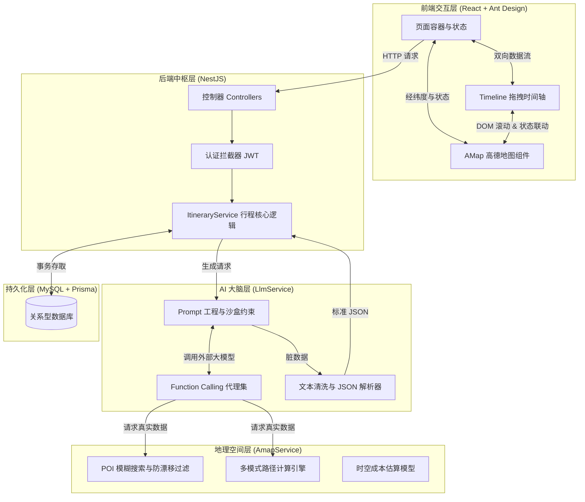

# 旅游路线规划网站 (TripAgent) - 底层原理与架构深度剖析

本文档旨在对 TripAgent 项目进行**深度解剖**。不仅涵盖宏观的架构图，还将深入到代码的每一处关键设计，详细解释大模型 Agent 的运行机制、地图交互的实现细节、前端状态管理的逻辑以及数据库设计的哲学。让任何接手该项目的开发者都能彻底看懂其“底层逻辑”。

---

## 1. 宏观系统架构图解

整个 TripAgent 系统采用**前后端分离**架构。前端负责极客级别的 UI/UX 交互，后端负责作为中枢调度 LLM（大脑）与高德地图（眼睛/腿）。



---

## 2. 核心大模型引擎 (LLM Agent) 底层实现

`LlmService` 是整个系统的心脏。它不仅仅是调用一次 OpenAI 的接口，而是实现了一个**带工具调用能力的自主 Agent**。

### 2.1 核心 System Prompt (系统提示词) 剖析
为了让 AI 输出可以直接存入数据库的确定性结构，我们在 Prompt 中注入了极其严苛的“沙盒约束”。以下是注入大模型的核心 Prompt 模板源码：

```typescript
const prompt = `
你是一个专业的金牌旅游规划师。请根据用户的需求，规划一份详细、合理、无缝衔接的旅游行程。

【用户需求】
出发地：${params.origin || '未指定'}
目的地：${params.destination}
出发日期：${params.startDate}
游玩天数：${params.durationDays}天
旅行偏好：${params.travelPreference || '无特别偏好'}
人均预算：${params.budget ? params.budget + '元' : '未限制'}
必去景点：${params.mustVisitSpots.join('、') || '无'}
前往目的地交通偏好：${params.toDestinationTransportMode === 'train' ? '火车' : params.toDestinationTransportMode === 'high_speed_train' ? '高铁' : params.toDestinationTransportMode === 'plane' ? '飞机' : '自驾'}
当地出行偏好：${params.transportMode === 'driving' ? '自驾' : params.transportMode === 'transit' ? '公共交通' : '打车'}

【规划原则】
1. 预算控制（极度重要）：必须严格计算花费，确保 \`totalEstimatedCost\` 绝对不能超过用户的总预算！
2. 数据真实性（极度重要）：强烈建议在规划前，调用 \`getLocalRecommendations\` 获取真实的景点、餐厅名字及人均消费！绝对禁止编造虚假的店名。
3. 时间与价格计算：对于任何交通，必须调用 \`calculateRouteEstimate\` 获取精准的耗时与花费，禁止随意编造！
   - \`durationMinutes\` 的含义：如果是 \`transport\`，是“在路上花的时间”；如果是 \`activity\`，是“游玩花的时间”。
4. 行程连贯性：如果出发地和目的地不同，必须在第一天安排去程大交通（乘坐用户指定的交通工具），并在最后一天安排合理的返程交通。
5. 每天结构：必须包含早上的景点、午餐、下午的景点、晚餐、入住酒店。每天晚上 22:00 前必须回酒店。

【输出格式】
请务必只输出合法的 JSON 格式，结构如下：
{
  "budgetAnalysis": "简要说明你将如何分配这笔预算，以确保不超支。",
  "totalEstimatedCost": 1500, 
  "days": [
    {
      "date": "2025-06-30",
      "dayNumber": 1,
      "items": [
        {
          "time": "08:00",
          "durationMinutes": 120,
          "title": "动作标题",
          "locationName": "具体地点", // 必须是真实存在的 POI 名称
          "type": "transport", // transport, activity, food, accommodation
          "estimatedCost": 200,
          "description": "结合旅行偏好、天气预报、真实周边地点评分和社交攻略，提供最具价值的建议"
        }
      ]
    }
  ]
}
`;
```

### 2.2 Agent 与 Function Calling (工具调用) 详细定义
在 `LlmService` 中，我们为大模型注册了四大核心 Tools。这些 Tools 的 `description` 经过精心打磨（Prompt Engineering），相当于给 AI 的使用说明书，告诉它在何时、如何调用。

#### Tool 1: `searchSocialMedia` (实时攻略嗅探器)
- **作用**：解决 LLM 知识库陈旧的问题，获取最新的防坑指南。
- **参数 (`parameters`)**:
  - `query` (string): 搜索关键词，例如 `'三亚 必吃美食'` 或 `'五台山 避坑攻略'`。
  - `platform` (enum): 平台选择 `["xiaohongshu", "douyin", "all"]`。
- **底层实现**：在 Node.js 中通过 `fetch` 模拟请求 DuckDuckGo Lite 版接口，拼接 `site:xiaohongshu.com` 语法，通过正则提取网页 Snippet，返回给 AI 作为规划参考。

#### Tool 2: `getWeatherForecast` (天气干预器)
- **作用**：获取目的地近期天气，帮助 AI 合理安排室内/室外行程。
- **参数 (`parameters`)**:
  - `city` (string): 城市名称，例如 `'三亚'`。
- **底层实现**：串联调用高德 API：先用地理编码 API 把 `city` 转成 `adcode`，再调用高德天气 API (`extensions: 'all'`) 抓取未来几天的天气现象与气温。

#### Tool 3: `getLocalRecommendations` (真实 POI 嗅探器)
- **作用**：**这是杜绝 AI 产生“虚假餐厅”幻觉的核心武器。** 当 AI 安排吃饭或住宿时，强制它调用此工具找真实的店名和真实的人均消费。
- **参数 (`parameters`)**:
  - `city` (string): 城市名称。
  - `keyword` (string): 搜索关键词，例如 `'特色美食'`、`'网红打卡景点'`。
- **底层实现**：高德 `place/around` API。根据 `keyword` 智能映射 `typeCode` (如美食映射 `050000`，景点映射 `110000`)。为了提高质量，底层会对返回结果按 `biz_ext.rating` (评分) 降序排列，并提取 `biz_ext.cost` (人均消费) 返回给 AI。

#### Tool 4: `calculateRouteEstimate` (精准时空测算器)
- **作用**：消除 AI 在交通时间和费用上的瞎编乱造，支持同城与跨城的大交通精准计算。
- **参数 (`parameters`)**:
  - `originName` (string): 出发地具体名称。对于跨城，被明确要求带上枢纽名（如：`'成都市成都东站'`）。
  - `destinationName` (string): 到达地具体名称。
  - `mode` (enum): 交通方式偏好 `["plane", "high_speed_train", "train", "driving", "taxi", "transit", "walking"]`。
- **底层实现**：见下方“3.2 城际大交通与市内预估模型”。

### 2.3 Agent 的运行生命周期 (Orchestration Flow)
为了让大模型成为一个能够不断思考、调用工具、直到完成任务的 Agent，我们设计了如下的 While 循环调度器源码结构：

```typescript
let maxToolCalls = 30; // 安全阈值，防止死循环
let messages = [{ role: 'user', content: prompt }];

// 第一轮请求大模型
let response = await openai.chat.completions.create({ model, messages, tools });
let responseMessage = response.choices[0].message;

// 只要模型返回了 tool_calls (想要调用工具)，就进入思考循环
while (responseMessage.tool_calls && maxToolCalls > 0) {
  // 1. 将模型的工具调用请求加入历史
  messages.push(responseMessage); 
  
  // 2. 遍历执行每一个本地工具
  for (const toolCall of responseMessage.tool_calls) {
    const args = JSON.parse(toolCall.function.arguments);
    let toolResult;
    
    // 路由分发到具体的本地函数
    if (toolCall.function.name === 'getLocalRecommendations') {
      toolResult = await getLocalRecommendations(args.city, args.keyword);
    } else if (toolCall.function.name === 'calculateRouteEstimate') {
      toolResult = await calculateRouteEstimate(args.originName, args.destinationName, args.mode);
    } // ... 其他工具
    
    // 3. 将工具的执行结果封装为 tool 消息塞回对话中
    messages.push({
      role: 'tool',
      tool_call_id: toolCall.id,
      content: JSON.stringify(toolResult),
    });
  }
  
  // 4. 带着外部世界的知识，再次请求大模型
  response = await openai.chat.completions.create({ model, messages, tools });
  responseMessage = response.choices[0].message;
  maxToolCalls--;
}

// 循环结束，此时 responseMessage.content 就是包含了最终 JSON 规划的回答
const finalContent = responseMessage.content;
```

### 2.4 文本清洗与 JSON 提取机制 (容错原理)
部分推理模型（如 DeepSeek R1 或 MiniMax）在输出最终 JSON 时，往往会夹带大量的思考过程或破损格式。我们在最后一道防线中加入了变态级别的正则清洗：

```typescript
let cleanContent = finalContent.trim();

// 1. 暴力剥离所有 XML 思考与调用过程标签
cleanContent = cleanContent.replace(/<think>[\s\S]*?<\/think>/g, '');
cleanContent = cleanContent.replace(/<minimax:thinking>[\s\S]*?<\/minimax:thinking>/g, '');
cleanContent = cleanContent.replace(/<invoke[\s\S]*?<\/invoke>/g, '');

// 2. 剥离 Markdown 代码块
cleanContent = cleanContent.replace(/```json/g, '').replace(/```/g, '');

// 3. 稳健 JSON 截取算法：只取第一个 '{' 到最后一个 '}' 之间的内容
const firstBrace = cleanContent.indexOf('{');
const lastBrace = cleanContent.lastIndexOf('}');
if (firstBrace !== -1 && lastBrace !== -1 && lastBrace > firstBrace) {
  cleanContent = cleanContent.substring(firstBrace, lastBrace + 1);
}

// 4. 修复模型常见的标点符号幻觉 (如 "cost":": 200,)
cleanContent = cleanContent.replace(/":":\s*/g, '": ');

// 5. 安全解析
const parsedJSON = JSON.parse(cleanContent);
```

---

## 3. 地理空间服务 (AmapService) 底层逻辑

`AmapService` 是系统的眼睛和腿，负责将 AI 产生的文本转化为地球上真实的坐标与路线。

### 3.1 POI 检索与防漂移算法
- **问题**：如果用户目的地填“忻州市”，AI 安排了“五台山”。高德 API 如果限制在忻州市内搜索，由于景区面积庞大或跨市，可能会返回 `[]`，导致前端地图将点画在经纬度 `[0,0]`（非洲西海岸）。
- **底层解决**：在 `ItineraryService` 解析 LLM 产出时，采用了**双重降级搜索**。首先精确搜索；如果找不到，全局搜索；如果还找不到，拼接 `目的地 + 景点名` 再次搜索。

```typescript
// 优先搜索具体地点，如果找不到，回退到全局或城市拼接搜索
const poiResult = await this.amapService.search(item.locationName, ''); // 传入空 city 进行全国搜索
const validPois = (poiResult.pois || []).filter(p => p.location);

if (validPois.length > 0) {
  const coords = validPois[0].location.split(',');
  lng = Number(coords[0]);
  lat = Number(coords[1]);
} else {
  // 降级：带上城市前缀再次搜索，解决同名地点的权重问题
  const fallbackResult = await this.amapService.search(`${destination} ${item.locationName}`, '');
  const fallbackValidPois = (fallbackResult.pois || []).filter(p => p.location);
  if (fallbackValidPois.length > 0) {
    const coords = fallbackValidPois[0].location.split(',');
    lng = Number(coords[0]);
    lat = Number(coords[1]);
  }
}
```

### 3.2 城际大交通与市内预估模型
`getIntercityRouteDetails` 方法负责计算交通成本：
- **API 优先**：先调用高德 `direction/driving` 获取驾车精准路径和过路费。
- **Haversine 算法保底**：如果 API 失败（比如跨海、没有驾车路线），底层会使用**球面距离公式 (Haversine)** 通过两点经纬度算出直线距离。
- **多模态交通预估**：
  - 如果用户选择**飞机**：按时速 800km/h 计算飞行时间，再固定加上 120 分钟（安检候机时间）；按 0.8元/km 计算机票价格。
  - 如果选择**高铁**：按 250km/h + 60分钟进出站；0.4元/km。
  - 如果选择**打车/驾车**：按高德实际反馈，或 40~80km/h 测算。
  - 这种分层测算保证了预算与时间在跨城游时的绝对可靠性。

```typescript
let distance = 0;
if (data && data.route && data.route.paths.length > 0) {
  distance = Math.ceil(parseInt(data.route.paths[0].distance, 10) / 1000); // 高德真实驾车距离 (km)
} else {
  // Haversine 球面距离保底计算
  const [lon1, lat1] = origin.split(',').map(Number);
  const [lon2, lat2] = destination.split(',').map(Number);
  const R = 6371; // 地球半径 km
  const dLat = (lat2 - lat1) * Math.PI / 180;
  const dLon = (lon2 - lon1) * Math.PI / 180;
  const a = Math.sin(dLat/2) * Math.sin(dLat/2) +
            Math.cos(lat1 * Math.PI / 180) * Math.cos(lat2 * Math.PI / 180) *
            Math.sin(dLon/2) * Math.sin(dLon/2);
  distance = R * (2 * Math.atan2(Math.sqrt(a), Math.sqrt(1-a)));
}

// 依据偏好返回精准时间和花费
if (preferredMode === 'high_speed_train') {
  const duration = Math.ceil((distance / 250) * 60) + 60; 
  const cost = Math.ceil(distance * 0.4); 
  return { duration, distance, cost, mode: TransportMode.transit, vehicle: '高铁' };
}
```

---

## 4. 前端交互与状态管理 (UI/UX)

前端（React + Ant Design）不只是数据的展示器，更是一套具备极致流畅体验的交互系统。

### 4.1 图文双向联动定位机制
- **正向联动 (左点右动)**：
  用户点击左侧时间轴（Timeline）的某一张卡片 -> React 状态 `selectedTimelineSpot` 发生变化 -> 地图组件 `useEffect` 监听到该状态 -> 调用高德实例的 `mapInstance.setZoomAndCenter(14, [lng, lat])`，地图平滑飞至该点并放大。

```javascript
// AMap.js 内部监听 selectedTimelineSpot 变化
useEffect(() => {
  if (center && center.longitude != null && center.latitude != null) {
    // 平滑飞行并放大到 14 级视角
    mapInstance.setZoomAndCenter(14, [center.longitude, center.latitude], false, 600);
  }
}, [center]);
```

- **反向联动 (右点左动)**：
  用户点击地图上的“水滴形”标点 -> 触发 `marker.on('click')` 事件 -> 向上抛出 `onClick` 回调 -> 将对应的节点设为选中态 -> 调用浏览器原生 DOM API 丝滑滚动。

```javascript
// ItineraryDetailPage.js 组装 Marker
const mapMarkers = validItems.map((item, index) => {
  return {
    longitude: item.longitude, latitude: item.latitude,
    isCustomIcon: true,
    icon: `<div class="pin">...</div>`, // 定制的水滴形 HTML
    onClick: (isUserClick) => {
      setSelectedTimelineSpot(item); // 触发左点右动（地图高亮变大）
      if (isUserClick) {
        // 原生 DOM 滚动：找到对应卡片，平滑滚动至容器中心
        document.getElementById(`timeline-item-${item.id}`)
                ?.scrollIntoView({ behavior: 'smooth', block: 'center' });
      }
    }
  };
});
```

### 4.2 前端地图防闪烁重绘机制
- **问题**：如果将“路线数据 (route)”作为 `AMap` 组件的 `key`，当路线异步计算完成后，React 会把整个地图组件卸载并重建，导致屏幕闪烁白屏。
- **底层解决**：将 `mapKey` 固定为日期 (`amap-${dateStr}`)。路线的变化只通过内部的 `useEffect` 监听。旧路线存在时，调用 `mapInstance.remove(mapPolyline)` 抹除，再实例化新的 `AMap.Polyline` 并 `mapInstance.add()`。这样底图完全不会重载，只有那条蓝色的折线会“生长”出来。

### 4.3 拖拽排序 (Dnd-kit) 的乐观更新
左侧行程单支持拖拽重新排序，底层逻辑如下：
1. 使用 `@dnd-kit` 的 `verticalListSortingStrategy` 监控拖拽动作。
2. 拖拽释放 (`onDragEnd`) 时，前端**立刻**在本地内存中通过 `arrayMove` 调整数组顺序，实现 UI 的瞬间响应（0延迟）。
3. 后台静默发起 API 请求，将带有新 `orderIndex` 的数组发送给后端。
4. 如果后端报错（如网络断开），前端再静默捕获异常并调用 `fetchItinerary()` 将数据回滚至服务器真实状态，保证了“极速体验”与“数据强一致性”的兼顾。

---

## 5. 数据库与持久化层 (Prisma)

### 5.1 表结构设计哲学
- **为何存 JSON Params？**
  在 `Itinerary` 表中，有一个特殊的字段 `generationParams`。它以 JSON 字符串形式原封不动地保存了用户最初填写的表单（预算、偏好、交通等）。
  这是为了实现**“就地重新规划”**功能。当用户对行程不满意点击“重新生成”时，后端直接读取该字段唤起大模型，**覆盖更新 (update)** 原有的 `PlanItem`，而不是在数据库中无脑新增 (`insert`) 成百上千个废弃的行程数据，极大地节约了数据库存储空间。

### 5.2 事务与并发安全
在 `ItineraryService` 的创建与更新逻辑中，严格使用了 `prisma.$transaction`。
例如在重新生成行程时：
```typescript
return this.prisma.$transaction(async (prisma) => {
  // 1. 删除旧的 plan items
  await prisma.planItem.deleteMany({ where: { itineraryId } });
  // 2. 更新主表元数据
  await prisma.itinerary.update({ ... });
  // 3. 批量插入全新的 plan items
  await prisma.planItem.createMany({ data: dataToCreate });
});
```
这种原子操作保证了如果在大批量插入明细数据时断电或报错，旧的数据也不会被意外清空，确保用户永远不会看到一份“残缺”的行程单。

---

## 6. 总结与未来展望

TripAgent 并非一个简单的“大模型套壳”玩具，而是一个深度整合了 **AI 推理能力**、**GIS 地理信息系统** 与 **复杂前端状态机** 的企业级工程。

从底层数据库的事务一致性，到大模型不可控输出的强力清洗纠错，再到前端地图与 DOM 的双向绑定渲染，系统在每一层都做了极其细致的防御性编程与性能优化。

未来，系统还可以朝着**多端协同（PWA/小程序）**、**引入真实酒店/票务下单 API 闭环** 以及 **支持多人协作实时编辑行程 (WebSocket)** 的方向继续演进。
